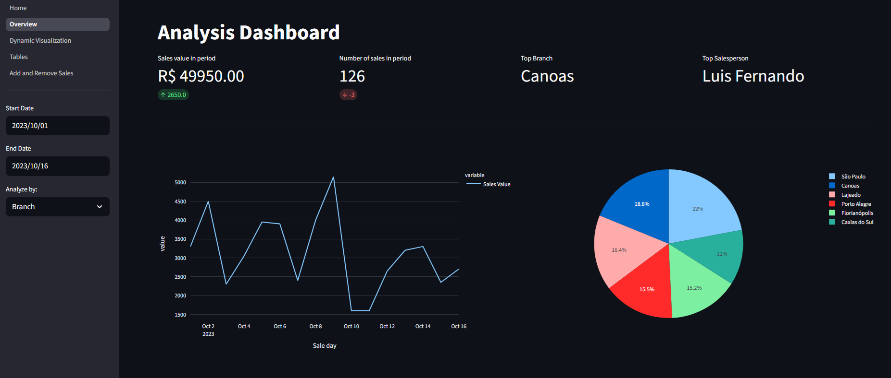
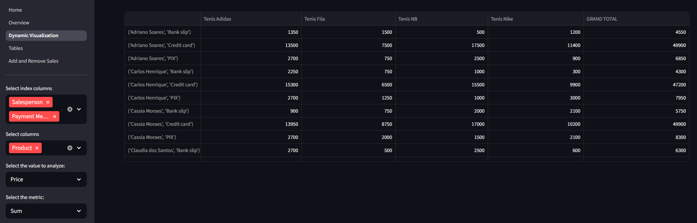
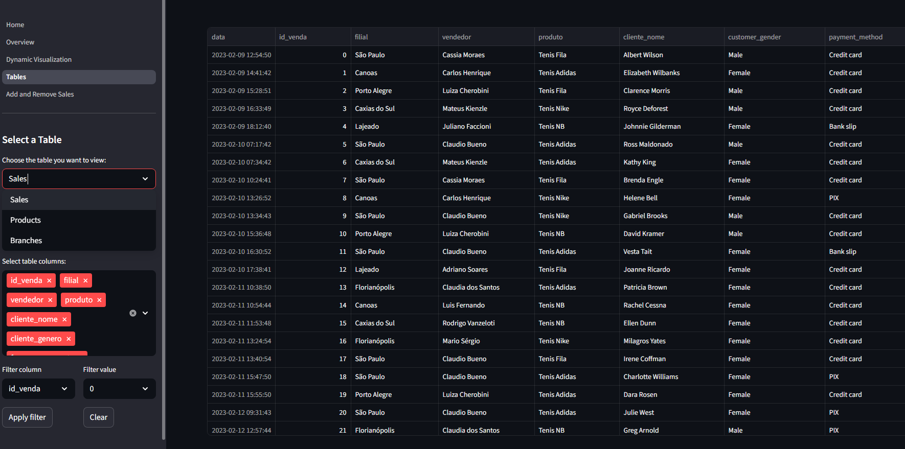

<!-- Cover image (replace when assets/cover.png is added) -->
<p align="center">
	
</p>

# Sales Analyzer — Turn raw data into decisions

An interactive Streamlit app that turns sales data into clear, actionable insight in seconds. Clone it, adapt it, ship it.

> From CSV to executive-ready dashboards in minutes. No fragile notebooks. No fuss.

## Highlights

- Human‑friendly UX: a clean, readable interface for fast analysis.
- Real‑time insight: filter, slice, and visualize performance instantly.
- Modular by design: clear separation between data loading, metrics, and pages.
- Production‑minded defaults: opinionated KPIs and stable visuals out of the box.

## Features

- Executive overview dashboard with top KPIs (sales value, volume, top branch, top salesperson)
- Dynamic pivot tables to explore sales by product, branch, gender, and payment method
- Tables page with fast ad‑hoc filtering for quick data exploration
- Add and remove sales directly in the app (persists to CSV)
- Interactive Plotly visuals and Streamlit‑native performance

## Innovations under the hood

- Zero‑DB persistence for speed: edits (add/remove sales) write straight to CSV — ideal for prototypes, workshops, and demos without infrastructure overhead.
- Composable pages: each page focuses on a single task (Overview, Dynamic Visualization, Tables, Add/Remove Sales) with shared state via `st.session_state`.
- Opinionated defaults: sensible metrics, crisp visuals, and minimal friction to get insight fast.

## Project structure

```
projeto_completo/
├─ datasets/
│  ├─ filiais.csv
│  ├─ produtos.csv
│  ├─ vendas.csv
├─ salesapp/
│  ├─ Home.py
│  ├─ utilidades.py
│  ├─ requirements.txt
│  └─ pages/
│     ├─ 1_Overview.py
│     ├─ 2_Dynamic_Visualization.py
│     ├─ 3_Tables.py
│     └─ 4_Add_and_Remove_Sales.py
└─ README.md
```

## Screenshots

| Overview | Dynamic Visualization |
|---|---|
|  |  |

| Tables |
|---|
|  |

## Quickstart

1) Create and activate a virtual environment

```powershell
# Windows PowerShell
python -m venv venv
& .\venv\Scripts\Activate.ps1
```

2) Install dependencies

```powershell
pip install -r .\salesapp\requirements.txt
```

3) Run the app

```powershell
streamlit run .\salesapp\Home.py
```

The app will open in your browser. Navigate via the sidebar.

## Data sources

- Synthetic sales data generated by a helper script (included in the repo) to simulate realistic sales operations across branches, products, and customer profiles.
- The original dataset was modeled after a retail context in Brazil, so the raw data uses Portuguese naming. This is fully adaptable to any language or market.

## Tech stack

- Streamlit for the web app UI
- Plotly for interactive charts
- Pandas for data transformation

## Design principles

- Clarity over complexity — the shortest path from data to decision.
- Modular code — pages and utilities that scale with your ideas.
- Fast feedback loop — instant interactions for better analysis.

## Extending the app

- Swap in a database (SQLite/Postgres) and a lightweight repository layer for multi-user write safety.
- Add authentication (e.g., Streamlit auth or OAuth proxy) for production demos.
- Enrich the data model: customer segments, product categories, targets, and forecasting.
- Add export actions (CSV/Excel) for filtered tables and charts.

## Troubleshooting

- If `streamlit` isn't found, ensure your virtual environment is active and dependencies are installed.
- If CSVs were edited outside the app, reload the page to refresh the cache.

## License

This project is provided for educational and demonstration purposes. Customize freely for your own use cases.
